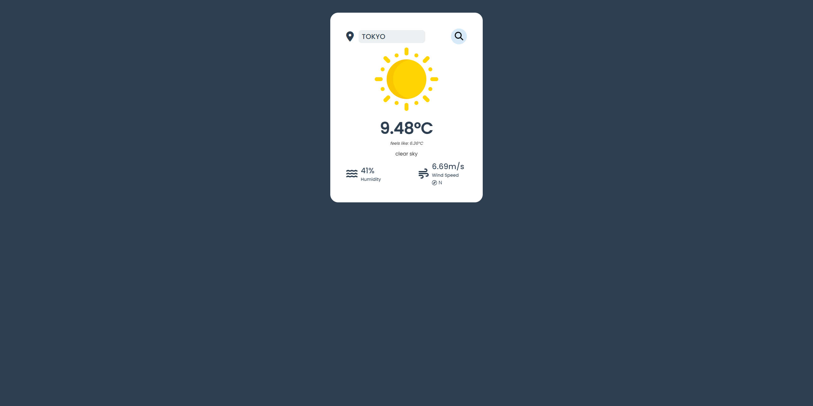

# Wheather app

Likewise my Imdb_clone, this projects is done in React using a API.

I found a similar design on YouTube and tried memorizing as much as possible and cloning it. I had great fun developing this clone and were excited in using React again

